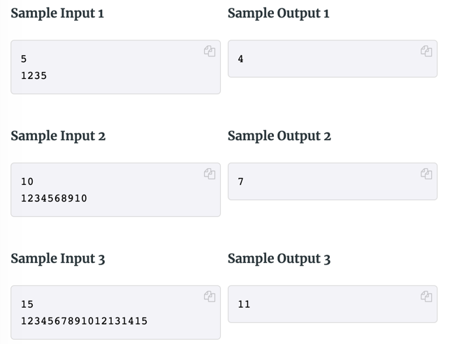

# data-max-internship-assignment

Data Max Internship Assignment

## Contact Details
<`FirstName`> <`Lastname`>

<`email`>

## Proposed Solution Details
- Time Complexity in terms of Big-O notation: 
- Algorithm summary: 

## Task: Write a program to solve the following problem:

You wrote down the numbers from 1 to `n`, in order, on a whiteboard. 
When you weren’t paying attention, a student erased one of the numbers.
Can you find the missing number?

---
### Input: 
The first line of input contains a single integer `n` (2 <= n <= 100), which is the number of numbers that you wrote down.

The second line of input contains a string of digits, which represents the numbers you wrote down (minus the one that has been erased). 
There are no spaces in this string. It is guaranteed to contain all the numbers from 1 to `n`, in order, 
except for the single number that the student erased.

---
### Output: a single integer, which is the number that was erased.

---
## Write a program that:
1. Loads the string of numbers in the input into a list of integers.
2. Finds the missing number from the list.

---
## Requirements
- Use only arrays/lists as data structures. Sets, trees or maps are not allowed.
- Aim for an optimal solution.
- Avoid using predefined functions like `sort`, `min`, `max`, etc.
- Preferred programming languages: C++, Java, Python
- Don't produce additional output other than the required output
- Use the defined input format ⚠️
  

---
## Solution submission
1. Create a new private repository for your exercise and add the hiring team members as private collaborators
2. Create, commit and push your solution
3. Add a `README.md` file with information about yourself and about your solution (Feel free to take parts from this repo's `README.md`)
4. Invite as contributors: [Sadik Bakiu](https://github.com/sbakiu/), [Bujar Bakiu](https://github.com/bbakiu/), [Redi Cane](https://github.com/redicane)

---
## Evaluation Criteria
1. Correctness of the solution
2. Time complexity of the solution
3. Clarity of the solution
4. Readability of the code
5. Memory efficiency of the solution